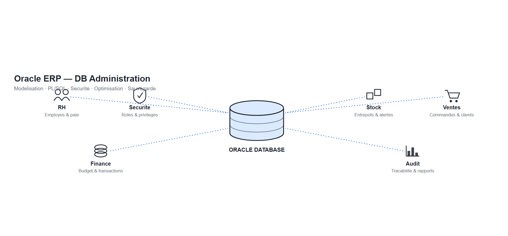
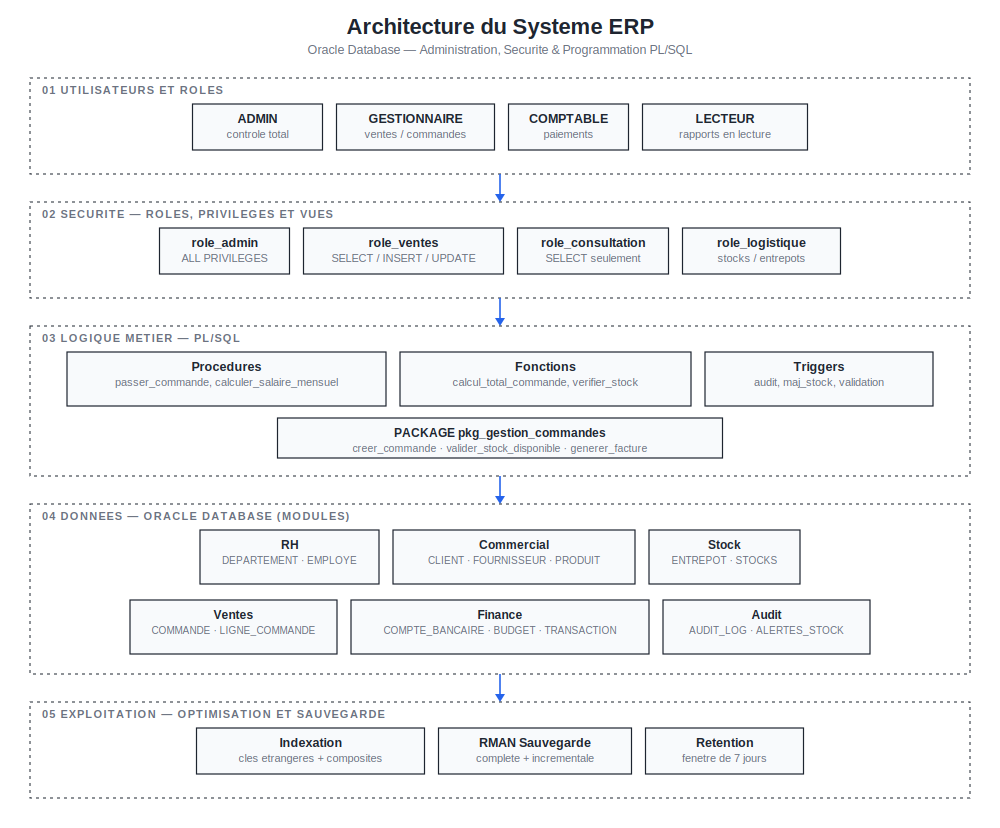
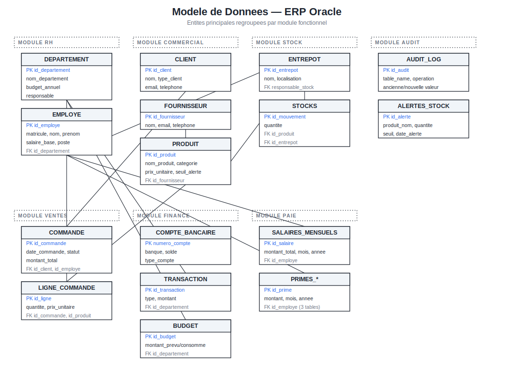
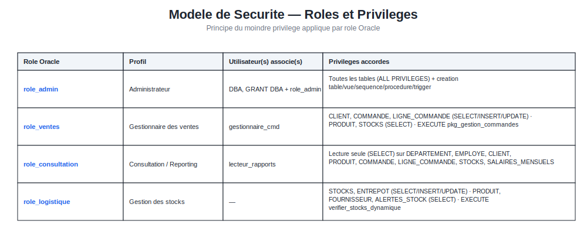

# Oracle ERP — DB Administration

<div align="center">


</div>



Projet d'administration de base de données réalisé dans le cadre du module **Administration des Bases de Données** (Filière Génie Informatique, Semestre 7) à l'**École Nationale des Sciences Appliquées de Berrechid** — Université Hassan 1er.

Le projet couvre l'ensemble du cycle de vie d'une base de données Oracle au service d'un **ERP (Enterprise Resource Planning)** : conception du modèle de données, implémentation DDL/DML, programmation PL/SQL (procédures, fonctions, triggers, package), gestion des utilisateurs et des privilèges, optimisation par indexation, et stratégie de sauvegarde/restauration avec RMAN.

---

## Sommaire

- [Aperçu](#aperçu)
- [Stack technique](#stack-technique)
- [Architecture du système](#architecture-du-système)
- [Structure du dépôt](#structure-du-dépôt)
- [Modèle de données](#modèle-de-données)
- [Sécurité — rôles et privilèges](#sécurité--rôles-et-privilèges)
- [Programmation PL/SQL](#programmation-plsql)
- [Optimisation des performances](#optimisation-des-performances)
- [Sauvegarde et restauration](#sauvegarde-et-restauration)
- [Tests](#tests)
- [Documentation et livrables](#documentation-et-livrables)
- [Installation et mise en route](#installation-et-mise-en-route)
- [Références](#références)

---

## Aperçu

Le système gère les domaines fonctionnels classiques d'un ERP d'entreprise :

| Domaine | Description |
|---|---|
| **Ressources humaines** | Départements, employés, salaires mensuels, primes (performance, ancienneté, département) |
| **Commercial** | Clients, fournisseurs, catalogue produits |
| **Logistique / Stock** | Entrepôts, mouvements et niveaux de stock, alertes de seuil |
| **Ventes** | Commandes, lignes de commande, calcul automatique des totaux |
| **Finance** | Comptes bancaires, transactions, suivi budgétaire par département |
| **Sécurité & audit** | Rôles applicatifs, privilèges granulaires, journal d'audit des opérations sensibles |

Le dépôt contient **deux implémentations complémentaires** du même cas d'usage :

1. **`erp_project/`** — une implémentation modulaire, organisée par type d'objet PL/SQL (un script par scénario fonctionnel), centrée sur le cycle commande → stock → paiement.
2. **`ERP - Gestion des Ressources d'Entreprise/`** — le livrable académique complet : un script Oracle unique couvrant un périmètre étendu (RH, finance, paie), accompagné du rapport et de la présentation du projet.

---

## Stack technique

| Composant | Rôle |
|---|---|
| **Oracle Database 21c** | Système de gestion de base de données relationnel-objet |
| **PL/SQL** | Procédures, fonctions, packages, triggers, curseurs, SQL dynamique |
| **SQL DDL/DML** | Modélisation des tables, contraintes, séquences, index, vues |
| **Oracle RMAN** | Sauvegarde complète et incrémentielle, politique de rétention |
| **SQL\*Plus** | Exécution et administration des scripts |

---

## Architecture du système

Vue d'ensemble des couches du système, des rôles utilisateurs jusqu'à l'exploitation de la base :



---

## Structure du dépôt

```text
.
├── .gitignore
├── Utilisateurs, Rôles & Privilèges.sql        # Rôles C## et utilisateurs (modèle simplifié)
│
├── ERP - Gestion des Ressources d'Entreprise/   # Livrable académique complet
│   ├── oracle_db_complete.sql                   # Schéma étendu : DDL + données + PL/SQL + index
│   ├── oracle_admin_scripts.sql                 # Utilisateurs, rôles, privilèges, vues
│   ├── presentation.pptx                        # Support de soutenance (11 diapositives)
│   ├── rapport.docx                             # Rapport complet du projet
│   └── rapport.pdf                              # Export PDF du rapport
│
└── erp_project/                                 # Implémentation modulaire par scénario
    ├── tablesMLD.sql                             # Création des tables (modèle logique)
    ├── sequences.sql                              # Séquences pour les clés primaires
    ├── security.sql                                # Réservé à la politique de sécurité
    ├── dataTest.sql                                  # Jeux de données et appels de test
    ├── ValidationTest.sql                              # Scénarios de validation fonctionnelle
    ├── Utilisateurs, Rôles & Privilèges.sql              # Rôles et utilisateurs (copie)
    │
    ├── Procedures/
    │   ├── scenario1.sql                          # passer_commande
    │   └── scenario5.sql                          # rapport_commandes_client
    │
    ├── Fonctions/
    │   └── scenario3.sql                          # calcul_total_commande
    │
    ├── Triggers/
    │   ├── scenario2.sql                          # trg_after_insert_ligne (mise à jour stock)
    │   └── scenario4.sql                          # trg_audit_produit (audit sécurité)
    │
    ├── Politique d'Optimisation/
    │   └── Indexation.sql                         # Index sur clés étrangères et recherches
    │
    └── Politique de Sauvegarde & Restauration/
        └── RMAN.sql                               # Configuration et commandes RMAN
```

---

## Modèle de données

Le diagramme ci-dessous présente les entités du **schéma étendu** (`oracle_db_complete.sql`), regroupées par module fonctionnel, avec leurs clés primaires (PK), clés étrangères (FK) et principales relations :



Le **schéma applicatif simplifié** (`erp_project/tablesMLD.sql`) reprend le cœur du cycle commande/stock avec 8 tables :

| Table | Rôle |
|---|---|
| `UTILISATEUR` | Comptes internes (ADMIN, GESTIONNAIRE, COMPTABLE) |
| `CLIENT` | Clients de l'entreprise |
| `PRODUIT` | Catalogue produits, prix, stock, seuil d'alerte |
| `COMMANDE` | Commandes passées par les clients |
| `LIGNE_COMMANDE` | Détail produit/quantité d'une commande |
| `PAIEMENT` | Paiements associés à une commande |
| `STOCK_MOUVEMENT` | Historique des entrées/sorties de stock |
| `AUDIT_LOG` | Journal des actions sensibles |

---

## Sécurité — rôles et privilèges

La gestion des accès applique le **principe du moindre privilège** via des rôles Oracle dédiés, plutôt que des privilèges accordés directement aux utilisateurs.



Le dépôt définit également un second modèle de rôles, plus simple, dans `Utilisateurs, Rôles & Privilèges.sql` (commun aux deux implémentations) :

| Rôle | Utilisateur | Accès |
|---|---|---|
| `C##ROLE_ADMIN` | `C##ADMIN_ERP` | Tous privilèges sur toutes les tables |
| `C##ROLE_GESTIONNAIRE` | `C##GEST_ERP` | CRUD sur `CLIENT`, `PRODUIT`, `COMMANDE`, `LIGNE_COMMANDE`, `STOCK_MOUVEMENT` |
| `C##ROLE_COMPTABLE` | `C##COMPTABLE_ERP` | Lecture des commandes/clients, gestion des paiements |

> Les mots de passe présents dans les scripts sont des valeurs de démonstration utilisées dans un cadre académique. Ils doivent être remplacés avant toute utilisation en dehors d'un environnement de test.

Le système expose en complément des **vues de sécurité** qui masquent les colonnes sensibles avant de les exposer en lecture :

- `V_EMPLOYE_PUBLIC` — masque les informations salariales des employés
- `V_STATS_VENTES` — statistiques de ventes agrégées
- `V_ETAT_STOCKS` — état des stocks avec niveau d'alerte calculé

---

## Programmation PL/SQL

### Procédures stockées

| Procédure | Scénario | Description |
|---|---|---|
| `passer_commande` | `Procedures/scenario1.sql` | Crée une commande, vérifie le stock disponible ligne par ligne, calcule le total, lève une exception si le stock est insuffisant |
| `rapport_commandes_client` | `Procedures/scenario5.sql` | Parcourt par curseur explicite l'historique des commandes d'un client et affiche un récapitulatif |
| `calculer_salaire_mensuel` | `oracle_db_complete.sql` | Calcule le salaire total de chaque employé actif en agrégeant les primes via SQL dynamique |
| `verifier_stocks_dynamique` | `oracle_db_complete.sql` | Génère des alertes de stock par catégorie de produit à l'aide d'un `BULK COLLECT` |

### Fonctions

| Fonction | Scénario | Description |
|---|---|---|
| `calcul_total_commande` | `Fonctions/scenario3.sql` | Retourne le montant total d'une commande à partir de ses lignes |
| `verifier_disponibilite_stock` | `oracle_db_complete.sql` | Fonction booléenne vérifiant la disponibilité d'un produit en stock |

### Triggers

| Trigger | Scénario | Événement | Description |
|---|---|---|---|
| `trg_after_insert_ligne` | `Triggers/scenario2.sql` | `AFTER INSERT` sur `LIGNE_COMMANDE` | Décrémente le stock, enregistre le mouvement, génère une alerte si le seuil est franchi |
| `trg_audit_produit` | `Triggers/scenario4.sql` | `AFTER INSERT/UPDATE/DELETE` sur `PRODUIT` | Journalise chaque modification de prix dans `AUDIT_LOG` |
| `audit_modifications_sensibles` | `oracle_db_complete.sql` | `AFTER` sur `SALAIRES_MENSUELS` | Audit des modifications de salaires (ancienne/nouvelle valeur) |
| `maj_montant_commande` | `oracle_db_complete.sql` | `AFTER` sur `LIGNE_COMMANDE` | Recalcule automatiquement le montant total de la commande parente |
| `verif_stock_avant_validation` | `oracle_db_complete.sql` | `BEFORE UPDATE` sur `COMMANDE` | Bloque le passage au statut `VALIDEE` si le stock est insuffisant |

### Package

`pkg_gestion_commandes` encapsule le cycle de vie complet d'une commande :

```sql
PROCEDURE creer_commande(p_id_client NUMBER, p_liste_produits VARCHAR2, p_id_commande OUT NUMBER);
FUNCTION  calculer_total_commande(p_id_commande NUMBER) RETURN NUMBER;
PROCEDURE valider_stock_disponible(p_id_commande NUMBER, p_disponible OUT BOOLEAN);
PROCEDURE generer_facture(p_id_commande NUMBER);
```

---

## Optimisation des performances

Une stratégie d'indexation cible les jointures fréquentes et les colonnes de recherche :

- **Index sur clés étrangères** : `COMMANDE(id_client)`, `LIGNE_COMMANDE(id_commande, id_produit)`, `STOCKS(id_produit, id_entrepot)`, etc.
- **Index composites** : `COMMANDE(date_commande, statut)`, `EMPLOYE(statut, id_departement)` pour les requêtes de filtrage combiné.
- **Index sur colonnes de recherche** : `CLIENT(nom)`, `PRODUIT(reference)`, `AUDIT_LOG(date_action)`.

Scripts concernés : `erp_project/Politique d'Optimisation/Indexation.sql` et la section *Création d'index d'optimisation* de `oracle_db_complete.sql`.

---

## Sauvegarde et restauration

La politique de sauvegarde repose sur **Oracle RMAN** (`Politique de Sauvegarde & Restauration/RMAN.sql`) :

```sql
CONFIGURE RETENTION POLICY TO RECOVERY WINDOW OF 7 DAYS;
CONFIGURE CONTROLFILE AUTOBACKUP ON;

BACKUP DATABASE PLUS ARCHIVELOG;                       -- sauvegarde complète
BACKUP INCREMENTAL LEVEL 1 DATABASE PLUS ARCHIVELOG;   -- sauvegarde incrémentielle
```

Une fenêtre de rétention de 7 jours garantit la possibilité de restauration à un point dans le temps récent, tout en limitant l'espace de stockage occupé par les sauvegardes.

---

## Tests

| Script | Objectif |
|---|---|
| `dataTest.sql` | Insertion d'un jeu de données de référence (utilisateur, client, produits) puis test de `passer_commande` via un curseur `SYS_REFCURSOR` |
| `ValidationTest.sql` | Vérifie la procédure de commande, la fonction de calcul de total, et le déclenchement du trigger d'audit lors d'une mise à jour de prix |
| Tests intégrés à `oracle_db_complete.sql` | Calcul de salaire, vérification de stock, création de commande via le package, validation des privilèges par profil |

---

## Documentation et livrables

Le dossier `ERP - Gestion des Ressources d'Entreprise/` contient les livrables académiques associés au projet :

- **`rapport.docx`** — rapport complet couvrant le contexte, la conception (MCD/MLD), l'implémentation, la programmation PL/SQL, la sécurité, l'optimisation, les tests et la conclusion.
- **`presentation.pptx`** — support reprenant le contexte, la modélisation, les scénarios fonctionnels avancés, la sécurité et la politique de sauvegarde.

---

## Installation et mise en route

**Prérequis** : une instance Oracle Database (19c/21c, y compris Oracle XE) accessible via SQL\*Plus ou SQL Developer.

Ordre d'exécution recommandé pour l'implémentation modulaire (`erp_project/`) :

```sql
-- 1. Structure
@tablesMLD.sql
@sequences.sql

-- 2. Sécurité
@"Utilisateurs, Rôles & Privilèges.sql"

-- 3. Logique métier
@Procedures/scenario1.sql
@Fonctions/scenario3.sql
@Triggers/scenario2.sql
@Triggers/scenario4.sql
@Procedures/scenario5.sql

-- 4. Optimisation
@"Politique d'Optimisation/Indexation.sql"

-- 5. Données et validation
@dataTest.sql
@ValidationTest.sql
```

Pour le schéma étendu, exécuter `oracle_db_complete.sql` puis `oracle_admin_scripts.sql` dans une instance dédiée.

---

## Références

- Oracle Corporation. *Oracle Database 21c Documentation* — [docs.oracle.com](https://docs.oracle.com/en/database/oracle/oracle-database/21/)
