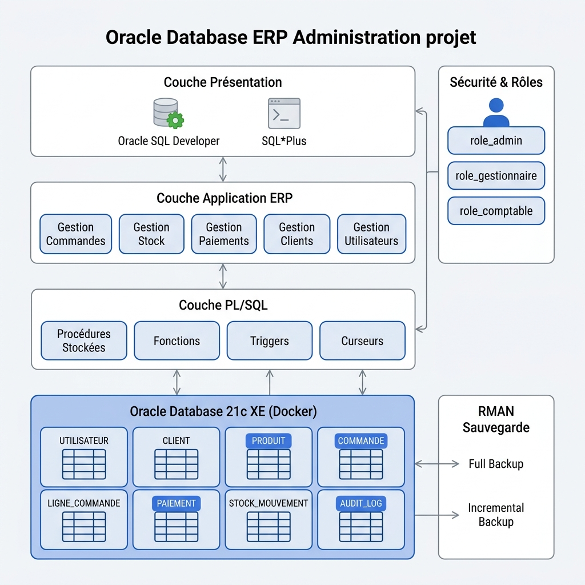
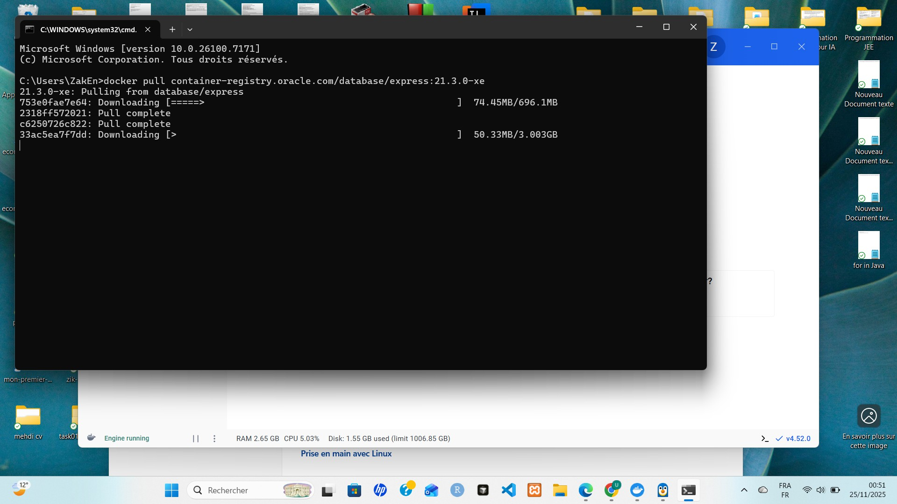
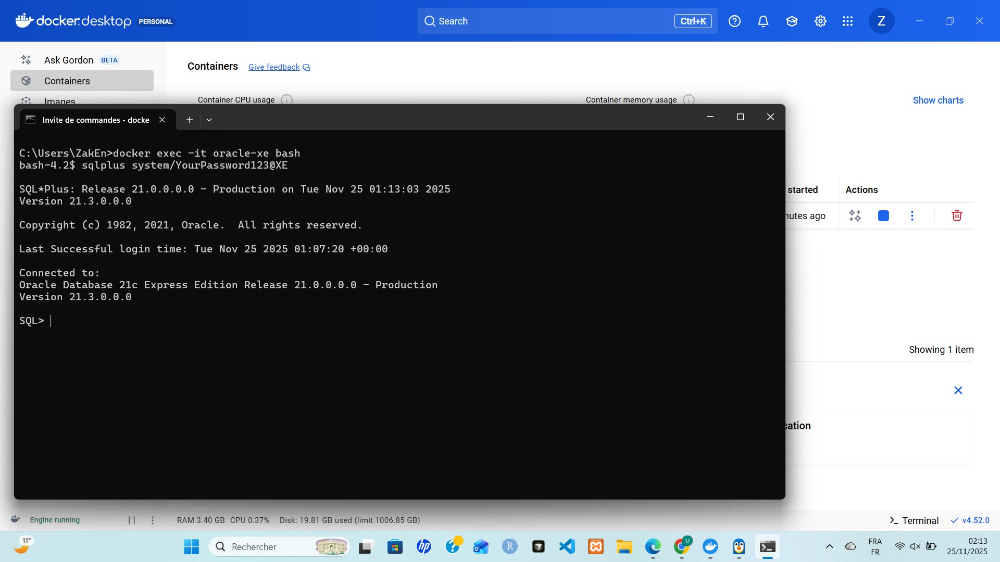
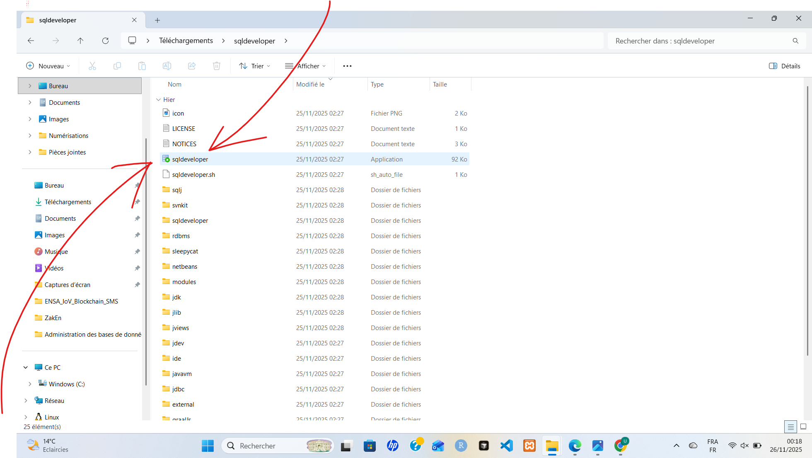
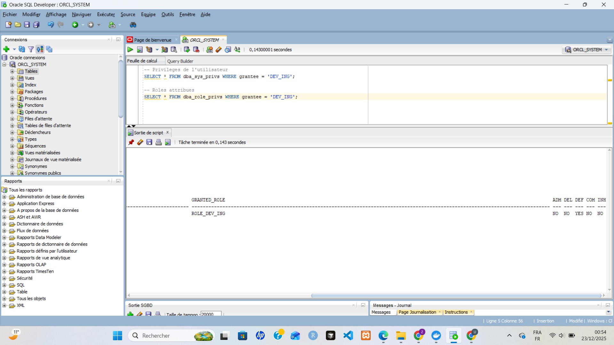
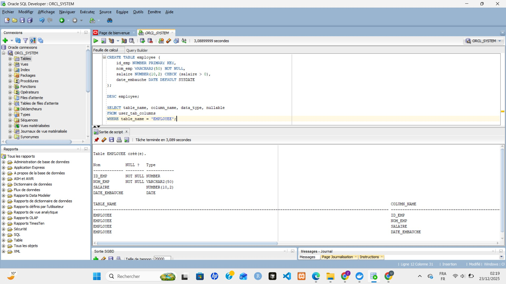

<div align="center">


# 🗄️ Administration de Base de Données Oracle — Projet ERP

> **Module :** Administration des Bases de Données · **Semestre :** S7 · **Filière :** Génie Informatique  
> **Encadrante :** Pr. Imane SAHMI · **ENSA Berrechid** · Université Hassan 1er  
> **Année universitaire :** 2025/2026 · **Réalisé par :** ENNAQUI Zakaria

</div>

---

## 📋 Table des Matières

- [Vue d'ensemble](#-vue-densemble)
- [Architecture du Projet](#-architecture-du-projet)
- [TP1 — Installation d'Oracle Database](#-tp1--installation-doracle-database)
- [TP2 — Administration Oracle Database](#-tp2--administration-oracle-database)
- [Projet ERP — Base de Données](#-projet-erp--base-de-données)
  - [Modèle de Données (MLD)](#modèle-de-données-mld)
  - [Structure des Tables](#structure-des-tables)
  - [Séquences](#séquences)
  - [Utilisateurs, Rôles & Privilèges](#utilisateurs-rôles--privilèges)
  - [Scénarios PL/SQL](#scénarios-plsql)
  - [Politique de Sauvegarde & Restauration](#politique-de-sauvegarde--restauration)
  - [Politique d'Optimisation](#politique-doptimisation)
- [Structure du Dépôt](#-structure-du-dépôt)
- [Technologies Utilisées](#-technologies-utilisées)

---

## 🎯 Vue d'ensemble

Ce projet couvre l'**administration complète d'une base de données Oracle** dans le cadre du module S7 de Génie Informatique à l'ENSA Berrechid. Il comprend :

1. **TP1** — Installation et configuration d'Oracle Database 21c XE via Docker
2. **TP2** — Administration avancée : tablespaces, utilisateurs, PL/SQL, RMAN
3. **Projet ERP** — Conception et implémentation d'une base de données ERP complète avec :
   - Modèle relationnel (8 tables)
   - Procédures stockées, fonctions, triggers
   - Gestion des utilisateurs et rôles Oracle
   - Politique de sauvegarde RMAN
   - Indexation et optimisation des performances

---

## 🏗️ Architecture du Projet



Le projet suit une architecture multi-couches :

| Couche | Composants |
|--------|-----------|
| **Présentation** | Oracle SQL Developer, SQL\*Plus |
| **Application ERP** | Gestion Commandes, Stock, Paiements, Clients, Utilisateurs |
| **PL/SQL** | Procédures, Fonctions, Triggers, Curseurs |
| **Base de Données** | Oracle Database 21c XE (Docker) |
| **Sécurité** | Rôles `role_admin`, `role_gestionnaire`, `role_comptable` |
| **Sauvegarde** | RMAN — Full Backup + Incrémentiel |

---

## 🔧 TP1 — Installation d'Oracle Database

### Objectifs
- Installer Oracle Database 21c XE
- Créer une base avec `SID=ORCL`
- Se connecter via SQL\*Plus et SQL Developer
- Explorer l'architecture via les vues système

### Environnement choisi

> Utilisation d'**Oracle 21c XE via Docker** comme alternative pratique à l'installation native, en respectant les paramètres `SID=ORCL` et `port=1521`.

### Étape 1 — Téléchargement de l'image Docker Oracle

```bash
docker pull container-registry.oracle.com/database/express:21.3.0-xe
```



### Étape 2 — Démarrage du conteneur

```bash
docker run -d \
  --name oracle-xe \
  -p 1521:1521 \
  -p 5500:5500 \
  -e ORACLE_PWD=YourPassword123 \
  container-registry.oracle.com/database/express:21.3.0-xe
```

### Étape 3 — Connexion SQL*Plus

```bash
docker exec -it oracle-xe bash
sqlplus system/YourPassword123@XE
```



### Commandes d'exploration système

```sql
-- Version de la base
SELECT * FROM v$version;

-- Instances et statut
SELECT instance_name, status, version FROM v$instance;

-- Tablespaces disponibles
SELECT tablespace_name, status FROM dba_tablespaces;

-- Fichiers de données
SELECT file_name, tablespace_name, bytes/1024/1024 AS size_mb FROM dba_data_files;

-- Utilisateurs de la base
SELECT username, account_status, created FROM dba_users ORDER BY created DESC;
```

### Partie 3 — Configuration de SQL Developer

| Paramètre | Valeur |
|-----------|--------|
| Nom | `ORCL_SYSTEM` |
| Utilisateur | `system` |
| Mot de passe | `YourPassword123` |
| Hostname | `localhost` |
| Port | `1521` |
| SID | `XE` |



### ✅ Résultats obtenus

- ✅ Base de données `ORCL` opérationnelle sur le port 1521
- ✅ Connexions SQL\*Plus et SQL Developer fonctionnelles
- ✅ Architecture Oracle explorée via les vues système

---

## 📚 TP2 — Administration Oracle Database

### Objectifs
Administration avancée Oracle : tablespaces, utilisateurs, PL/SQL, SQL Net, RMAN.

### Partie 2 — Gestion des Tablespaces

```sql
-- Création du tablespace TS_ING avec extension automatique
CREATE TABLESPACE TS_ING
  DATAFILE 'ts_ing.dbf'
  SIZE 10M
  AUTOEXTEND ON NEXT 5M MAXSIZE UNLIMITED
  LOGGING;
```

**Rôle d'un tablespace dans Oracle :**
- Unité de stockage logique regroupant des objets (tables, index)
- Séparation physique des données via les fichiers de données
- Gestion des quotas utilisateur par tablespace
- Optimisation des performances (stockage sur différents disques)

### Partie 3 — Utilisateurs, Privilèges & Rôles

```sql
-- Création des utilisateurs ingénieur
CREATE USER DEV_ING IDENTIFIED BY password
  DEFAULT TABLESPACE TS_ING
  QUOTA UNLIMITED ON TS_ING;

-- Création d'un rôle métier
CREATE ROLE ROLE_DEV_ING;

-- Attribution de privilèges
GRANT CREATE SESSION, CREATE TABLE, CREATE VIEW TO ROLE_DEV_ING;
GRANT ROLE_DEV_ING TO DEV_ING;
```



**Intérêt des rôles :**
- 🔐 **Sécurité** : modification centralisée des droits
- 📋 **Audit** : traçabilité via les rôles attribués
- 🎯 **Séparation** des responsabilités : rôles métier définis

### Partie 4 — SQL Net (Oracle Net Services)

```
# Configuration tnsnames.ora
ORCL =
  (DESCRIPTION =
    (ADDRESS = (PROTOCOL = TCP)(HOST = localhost)(PORT = 1521))
    (CONNECT_DATA = (SID = XE))
  )
```

**Rôle de SQL Net :**
- Communication réseau : protocole propriétaire Oracle
- Transparence réseau : abstraction de la localisation physique
- Sécurité : chiffrement des flux réseau
- Load balancing : répartition de charge entre instances

### Partie 5 — Création des Tables

```sql
-- Table EMPLOYEE avec contraintes
CREATE TABLE employee (
    id_emp     NUMBER PRIMARY KEY,
    nom_emp    VARCHAR2(50) NOT NULL,
    salaire    NUMBER(10,2) CHECK (salaire > 0),
    date_embauche DATE DEFAULT SYSDATE
);
```



### Partie 6 — Programmation PL/SQL

**Curseur explicite pour calcul de salaire :**
```plsql
DECLARE
    CURSOR cur_emp IS SELECT id_emp, nom_emp, salaire FROM employee;
    v_emp cur_emp%ROWTYPE;
    v_bonus NUMBER;
BEGIN
    OPEN cur_emp;
    LOOP
        FETCH cur_emp INTO v_emp;
        EXIT WHEN cur_emp%NOTFOUND;
        v_bonus := v_emp.salaire * 0.10;
        DBMS_OUTPUT.PUT_LINE(v_emp.nom_emp || ' - Bonus: ' || v_bonus);
    END LOOP;
    CLOSE cur_emp;
END;
/
```

**Trigger de contrôle de salaire :**
```plsql
CREATE OR REPLACE TRIGGER trg_check_salaire
BEFORE INSERT OR UPDATE ON employee
FOR EACH ROW
BEGIN
    IF :NEW.salaire < 2000 THEN
        RAISE_APPLICATION_ERROR(-20001, 'Salaire inférieur au minimum légal (2000)');
    END IF;
END;
/
```

### Partie 7 — Sauvegarde et Restauration RMAN

**Pourquoi RMAN est recommandé :**
- ✅ **Natif à Oracle** : optimisation pour les structures Oracle
- ✅ **Journalisation complète** : traçabilité des opérations
- ✅ **Compression intégrée** : réduction de l'espace de stockage
- ✅ **Vérification des backups** : `VALIDATE BACKUP`
- ✅ **Gestion des archive logs** : automatique avec `PLUS ARCHIVELOG`

---

## 💼 Projet ERP — Base de Données

### Présentation

Conception et administration d'une base de données Oracle pour un système **ERP (Enterprise Resource Planning)** complet, gérant : clients, produits, commandes, paiements, stock et audit.

### Modèle de Données (MLD)

Le modèle relationnel étendu du système ERP comprend les entités suivantes :


---

### Structure des Tables

Le schéma `erp_project` comprend **8 tables** :

```sql
-- 1. UTILISATEUR — Gestion des comptes applicatifs
CREATE TABLE UTILISATEUR (
    id_user         NUMBER PRIMARY KEY,
    nom             VARCHAR2(50),
    prenom          VARCHAR2(50),
    email           VARCHAR2(100) UNIQUE,
    mot_de_passe    VARCHAR2(100),
    role            VARCHAR2(20) CHECK (role IN ('ADMIN','GESTIONNAIRE','COMPTABLE')),
    statut          VARCHAR2(10) DEFAULT 'ACTIF',
    date_creation   DATE DEFAULT SYSDATE,
    derniere_connexion DATE
);

-- 2. CLIENT
CREATE TABLE CLIENT (
    id_client   NUMBER PRIMARY KEY,
    nom         VARCHAR2(50),
    email       VARCHAR2(100),
    telephone   VARCHAR2(15),
    adresse     VARCHAR2(200),
    ville       VARCHAR2(50),
    pays        VARCHAR2(50),
    statut      VARCHAR2(10) DEFAULT 'ACTIF'
);

-- 3. PRODUIT
CREATE TABLE PRODUIT (
    id_produit      NUMBER PRIMARY KEY,
    reference       VARCHAR2(20) UNIQUE,
    libelle         VARCHAR2(100),
    prix_unitaire   NUMBER(10,2),
    quantite_stock  NUMBER DEFAULT 0,
    seuil_alerte    NUMBER DEFAULT 10,
    categorie       VARCHAR2(50),
    statut          VARCHAR2(10) DEFAULT 'DISPONIBLE'
);

-- 4. COMMANDE
CREATE TABLE COMMANDE (
    id_commande     NUMBER PRIMARY KEY,
    date_commande   DATE DEFAULT SYSDATE,
    statut          VARCHAR2(20) DEFAULT 'EN_ATTENTE',
    total           NUMBER(10,2) DEFAULT 0,
    id_client       NUMBER REFERENCES CLIENT(id_client),
    id_user         NUMBER REFERENCES UTILISATEUR(id_user)
);

-- 5. LIGNE_COMMANDE (table de jointure)
CREATE TABLE LIGNE_COMMANDE (
    id_ligne        NUMBER PRIMARY KEY,
    id_commande     NUMBER REFERENCES COMMANDE(id_commande),
    id_produit      NUMBER REFERENCES PRODUIT(id_produit),
    quantite        NUMBER,
    prix_unitaire   NUMBER(10,2)
);

-- 6. PAIEMENT
CREATE TABLE PAIEMENT (
    id_paiement             NUMBER PRIMARY KEY,
    date_paiement           DATE DEFAULT SYSDATE,
    montant                 NUMBER(10,2),
    mode_paiement           VARCHAR2(20),
    statut_paiement         VARCHAR2(20) DEFAULT 'EN_ATTENTE',
    reference_transaction   VARCHAR2(100),
    id_commande             NUMBER REFERENCES COMMANDE(id_commande)
);

-- 7. STOCK_MOUVEMENT — Traçabilité des entrées/sorties
CREATE TABLE STOCK_MOUVEMENT (
    id_mouvement    NUMBER PRIMARY KEY,
    type_mouvement  VARCHAR2(10) CHECK (type_mouvement IN ('ENTREE','SORTIE')),
    quantite        NUMBER,
    date_mouvement  DATE DEFAULT SYSDATE,
    motif           VARCHAR2(200),
    id_produit      NUMBER REFERENCES PRODUIT(id_produit)
);

-- 8. AUDIT_LOG — Journal d'audit complet
CREATE TABLE AUDIT_LOG (
    id_log          NUMBER PRIMARY KEY,
    utilisateur     VARCHAR2(100),
    action          VARCHAR2(50),
    table_concernee VARCHAR2(50),
    date_action     DATE DEFAULT SYSDATE,
    details         VARCHAR2(500)
);
```

---

### Séquences

Auto-incrémentation des clés primaires via des séquences Oracle :

```sql
CREATE SEQUENCE seq_utilisateur START WITH 1 INCREMENT BY 1;
CREATE SEQUENCE seq_client      START WITH 1 INCREMENT BY 1;
CREATE SEQUENCE seq_produit     START WITH 1 INCREMENT BY 1;
CREATE SEQUENCE seq_commande    START WITH 1 INCREMENT BY 1;
CREATE SEQUENCE seq_ligne       START WITH 1 INCREMENT BY 1;
CREATE SEQUENCE seq_paiement    START WITH 1 INCREMENT BY 1;
CREATE SEQUENCE seq_mouvement   START WITH 1 INCREMENT BY 1;
CREATE SEQUENCE seq_audit       START WITH 1 INCREMENT BY 1;
```

---

### Utilisateurs, Rôles & Privilèges

Trois rôles métiers sont définis, appliquant le **principe du moindre privilège** :

```sql
-- Création des rôles Oracle (préfixe C## pour CDB)
CREATE ROLE C##ROLE_ADMIN;
CREATE ROLE C##ROLE_GESTIONNAIRE;
CREATE ROLE C##ROLE_COMPTABLE;

-- ADMIN : accès complet à toutes les tables
GRANT ALL PRIVILEGES ON UTILISATEUR      TO C##ROLE_ADMIN;
GRANT ALL PRIVILEGES ON CLIENT           TO C##ROLE_ADMIN;
GRANT ALL PRIVILEGES ON PRODUIT          TO C##ROLE_ADMIN;
GRANT ALL PRIVILEGES ON COMMANDE         TO C##ROLE_ADMIN;
-- ... (toutes les tables)

-- GESTIONNAIRE : CRUD clients, produits, commandes
GRANT SELECT, INSERT, UPDATE ON CLIENT          TO C##ROLE_GESTIONNAIRE;
GRANT SELECT, INSERT, UPDATE ON PRODUIT         TO C##ROLE_GESTIONNAIRE;
GRANT SELECT, INSERT, UPDATE ON COMMANDE        TO C##ROLE_GESTIONNAIRE;
GRANT SELECT, INSERT, UPDATE ON STOCK_MOUVEMENT TO C##ROLE_GESTIONNAIRE;

-- COMPTABLE : lecture commandes + gestion paiements
GRANT SELECT              ON COMMANDE TO C##ROLE_COMPTABLE;
GRANT SELECT, INSERT, UPDATE ON PAIEMENT TO C##ROLE_COMPTABLE;

-- Création des utilisateurs et attribution des rôles
CREATE USER C##ADMIN_ERP     IDENTIFIED BY "Admin123!";
CREATE USER C##GEST_ERP      IDENTIFIED BY "Gest123!";
CREATE USER C##COMPTABLE_ERP IDENTIFIED BY "Compta123!";

GRANT C##ROLE_ADMIN        TO C##ADMIN_ERP;
GRANT C##ROLE_GESTIONNAIRE TO C##GEST_ERP;
GRANT C##ROLE_COMPTABLE    TO C##COMPTABLE_ERP;
```

| Rôle | Tables accessibles | Opérations |
|------|--------------------|------------|
| `C##ROLE_ADMIN` | Toutes (8 tables) | ALL PRIVILEGES |
| `C##ROLE_GESTIONNAIRE` | CLIENT, PRODUIT, COMMANDE, LIGNE_COMMANDE, STOCK_MOUVEMENT | SELECT, INSERT, UPDATE |
| `C##ROLE_COMPTABLE` | COMMANDE (R), CLIENT (R), PAIEMENT | SELECT, INSERT, UPDATE |

---

### Scénarios PL/SQL

#### 📌 Scénario 1 — Procédure `passer_commande`

Procédure complète pour créer une commande avec vérification du stock, calcul du total et commit transactionnel.

```plsql
CREATE OR REPLACE PROCEDURE passer_commande (
    p_id_client NUMBER,
    p_id_user   NUMBER,
    p_lignes    SYS_REFCURSOR
) AS
    v_id_commande    NUMBER;
    v_produit_id     NUMBER;
    v_quantite       NUMBER;
    v_prix           NUMBER;
    v_total_commande NUMBER := 0;
    v_stock_actuel   NUMBER;
BEGIN
    SELECT seq_commande.NEXTVAL INTO v_id_commande FROM dual;
    INSERT INTO COMMANDE (id_commande, id_client, id_user, date_commande)
    VALUES (v_id_commande, p_id_client, p_id_user, SYSDATE);

    LOOP
        FETCH p_lignes INTO v_produit_id, v_quantite;
        EXIT WHEN p_lignes%NOTFOUND;

        SELECT quantite_stock INTO v_stock_actuel
        FROM PRODUIT WHERE id_produit = v_produit_id;

        IF v_stock_actuel < v_quantite THEN
            RAISE_APPLICATION_ERROR(-20001,
                'Stock insuffisant pour le produit ID: ' || v_produit_id);
        END IF;

        SELECT prix_unitaire INTO v_prix
        FROM PRODUIT WHERE id_produit = v_produit_id;

        INSERT INTO LIGNE_COMMANDE
            (id_ligne, id_commande, id_produit, quantite, prix_unitaire)
        VALUES (seq_ligne.NEXTVAL, v_id_commande, v_produit_id, v_quantite, v_prix);

        v_total_commande := v_total_commande + (v_quantite * v_prix);
    END LOOP;

    UPDATE COMMANDE SET total = v_total_commande WHERE id_commande = v_id_commande;
    COMMIT;
    DBMS_OUTPUT.PUT_LINE('Commande ' || v_id_commande || ' créée avec succès.');
END;
/
```

#### 📌 Scénario 2 — Trigger `trg_after_insert_ligne`

Trigger automatique de mise à jour du stock après chaque insertion de ligne de commande, avec alerte si le seuil est dépassé.

```plsql
CREATE OR REPLACE TRIGGER trg_after_insert_ligne
AFTER INSERT ON LIGNE_COMMANDE
FOR EACH ROW
DECLARE
    v_nouveau_stock NUMBER;
BEGIN
    UPDATE PRODUIT
    SET quantite_stock = quantite_stock - :NEW.quantite
    WHERE id_produit = :NEW.id_produit
    RETURNING quantite_stock INTO v_nouveau_stock;

    INSERT INTO STOCK_MOUVEMENT
        (id_mouvement, type_mouvement, quantite, id_produit, motif)
    VALUES (seq_mouvement.NEXTVAL, 'SORTIE', :NEW.quantite, :NEW.id_produit,
            'Vente commande ' || :NEW.id_commande);

    -- Alerte stock faible
    IF v_nouveau_stock < (SELECT seuil_alerte FROM PRODUIT
                          WHERE id_produit = :NEW.id_produit) THEN
        INSERT INTO AUDIT_LOG (id_log, utilisateur, action, table_concernee, details)
        VALUES (seq_audit.NEXTVAL, USER, 'ALERTE_STOCK', 'PRODUIT',
                'Stock faible (' || v_nouveau_stock || ') pour produit ID: ' || :NEW.id_produit);
    END IF;
END;
/
```

#### 📌 Scénario 3 — Fonction `calcul_total_commande`

```plsql
CREATE OR REPLACE FUNCTION calcul_total_commande (
    p_id_commande NUMBER
) RETURN NUMBER AS
    v_total NUMBER;
BEGIN
    SELECT SUM(quantite * prix_unitaire)
    INTO v_total
    FROM LIGNE_COMMANDE
    WHERE id_commande = p_id_commande;

    RETURN NVL(v_total, 0);
END;
/
```

#### 📌 Scénario 4 — Trigger d'Audit `trg_audit_produit`

Enregistre chaque modification (INSERT/UPDATE/DELETE) sur la table PRODUIT dans l'AUDIT_LOG.

```plsql
CREATE OR REPLACE TRIGGER trg_audit_produit
AFTER INSERT OR UPDATE OR DELETE ON PRODUIT
FOR EACH ROW
DECLARE
    v_action VARCHAR2(10);
BEGIN
    IF INSERTING THEN v_action := 'INSERT';
    ELSIF UPDATING THEN v_action := 'UPDATE';
    ELSE v_action := 'DELETE';
    END IF;

    INSERT INTO AUDIT_LOG (id_log, utilisateur, action, table_concernee, details)
    VALUES (seq_audit.NEXTVAL, USER, v_action, 'PRODUIT',
            'Produit ' || COALESCE(:NEW.id_produit, :OLD.id_produit) ||
            ' - Ancien prix: ' || :OLD.prix_unitaire ||
            ', Nouveau prix: ' || :NEW.prix_unitaire);
END;
/
```

#### 📌 Scénario 5 — Curseur `rapport_commandes_client`

Procédure avec curseur explicite pour générer un rapport des commandes par client.

```plsql
CREATE OR REPLACE PROCEDURE rapport_commandes_client (
    p_id_client NUMBER
) AS
    CURSOR cur_commandes IS
        SELECT c.id_commande, c.date_commande, c.total,
               u.nom AS nom_utilisateur, u.prenom AS prenom_utilisateur
        FROM COMMANDE c
        JOIN UTILISATEUR u ON c.id_user = u.id_user
        WHERE c.id_client = p_id_client
        ORDER BY c.date_commande DESC;

    v_commande      cur_commandes%ROWTYPE;
    v_total_client  NUMBER := 0;
BEGIN
    OPEN cur_commandes;
    DBMS_OUTPUT.PUT_LINE('=== RAPPORT DES COMMANDES ===');

    LOOP
        FETCH cur_commandes INTO v_commande;
        EXIT WHEN cur_commandes%NOTFOUND;

        DBMS_OUTPUT.PUT_LINE(
            'Commande: ' || v_commande.id_commande ||
            ' - Date: ' || TO_CHAR(v_commande.date_commande, 'DD/MM/YYYY') ||
            ' - Total: ' || v_commande.total ||
            ' - Gestionnaire: ' || v_commande.prenom_utilisateur || ' ' || v_commande.nom_utilisateur
        );
        v_total_client := v_total_client + v_commande.total;
    END LOOP;

    CLOSE cur_commandes;
    DBMS_OUTPUT.PUT_LINE('Total général client: ' || v_total_client);
END;
/
```

---

### Politique de Sauvegarde & Restauration

**Stratégie RMAN — Full + Incrémentiel Cumulatif :**


```sql
-- Configuration de la rétention (fenêtre de 7 jours)
CONFIGURE RETENTION POLICY TO RECOVERY WINDOW OF 7 DAYS;
CONFIGURE CONTROLFILE AUTOBACKUP ON;

-- Sauvegarde complète (Full Backup)
BACKUP DATABASE PLUS ARCHIVELOG;

-- Sauvegarde incrémentielle (niveau 1)
BACKUP INCREMENTAL LEVEL 1 DATABASE PLUS ARCHIVELOG;
```

**Procédure de restauration :**
1. `LIST BACKUP;` — Identifier la sauvegarde
2. `SHUTDOWN IMMEDIATE;` — Arrêter la base
3. `STARTUP MOUNT;` — Démarrer en mode mount
4. `RESTORE DATABASE;` — Restaurer les fichiers
5. `RECOVER DATABASE;` — Appliquer les journaux
6. `ALTER DATABASE OPEN RESETLOGS;` — Ouvrir la base

---

### Politique d'Optimisation

**Indexation des colonnes fréquemment utilisées :**

```sql
-- Index sur les clés étrangères (améliore les JOINs)
CREATE INDEX idx_commande_client  ON COMMANDE(id_client);
CREATE INDEX idx_commande_user    ON COMMANDE(id_user);
CREATE INDEX idx_ligne_commande   ON LIGNE_COMMANDE(id_commande);
CREATE INDEX idx_ligne_produit    ON LIGNE_COMMANDE(id_produit);
CREATE INDEX idx_stock_produit    ON STOCK_MOUVEMENT(id_produit);

-- Index pour les recherches fréquentes
CREATE INDEX idx_client_email     ON CLIENT(email);
CREATE INDEX idx_produit_reference ON PRODUIT(reference);
CREATE INDEX idx_audit_date       ON AUDIT_LOG(date_action);
```

---

## 📁 Structure du Dépôt

```
📦 Oracle-ERP-DB-Administration/
├── 📂 erp_project/
│   ├── 📄 tablesMLD.sql              ← Schéma des 8 tables
│   ├── 📄 sequences.sql              ← Séquences Oracle
│   ├── 📄 Utilisateurs, Rôles & Privilèges.sql
│   ├── 📄 dataTest.sql               ← Données de test
│   ├── 📄 ValidationTest.sql         ← Tests de validation
│   ├── 📄 security.sql
│   ├── 📂 Procédures/
│   │   ├── 📄 scénario1.sql          ← Procédure passer_commande
│   │   └── 📄 scénario5.sql          ← Curseur rapport commandes
│   ├── 📂 Triggers/
│   │   ├── 📄 scénario2.sql          ← Trigger mise à jour stock
│   │   └── 📄 scénario4.sql          ← Trigger audit sécurité
│   ├── 📂 Fonctions/
│   │   └── 📄 scénario3.sql          ← Fonction calcul total
│   ├── 📂 Politique de Sauvegarde & Restauration/
│   │   └── 📄 RMAN.sql               ← Scripts RMAN
│   └── 📂 Politique d'Optimisation/
│       └── 📄 Indexation.sql         ← Index de performance
├── 📂 assets/
│   ├── 🖼️ architecture.png           ← Diagramme d'architecture
│   ├── 🖼️ Screenshot 2026-06-24 213042.png  ← Stratégie RMAN
│   └── 🖼️ Screenshot 2026-06-24 213841.png  ← MLD ERP étendu
├── 📄 Utilisateurs, Rôles & Privilèges.sql  ← Version CDB Oracle
├── 📄 COMPTE_RENDU_TP1_Installation_Oracle.docx
├── 📄 TP - Administration Oracle Database.docx
├── 📄 Mini-projets BD.pdf
└── 📄 README.md
```

---

## 🛠️ Technologies Utilisées

| Technologie | Version | Usage |
|-------------|---------|-------|
| **Oracle Database XE** | 21c (21.3.0) | SGBD principal |
| **PL/SQL** | Oracle 21c | Programmation procédurale |
| **SQL\*Plus** | 21c | Interface CLI |
| **Oracle SQL Developer** | 23.x | IDE graphique |
| **Docker** | Desktop | Conteneurisation Oracle |
| **RMAN** | Oracle 21c | Sauvegarde & restauration |

---

## 🎓 Contexte Académique

> **ENSA Berrechid** — École Nationale des Sciences Appliquées de Berrechid  
> Université Hassan 1er · Berrechid, Maroc  
> Module **Administration des Bases de Données** · S7 Génie Informatique  
> Encadrante : **Pr. Imane SAHMI** · Année 2025/2026

---

<div align="center">

**ENNAQUI Zakaria** · [github.com/zakariaennaqui](https://github.com/zakariaennaqui) · [zakaria-ennaqui.vercel.app](https://zakaria-ennaqui.vercel.app)

</div>
